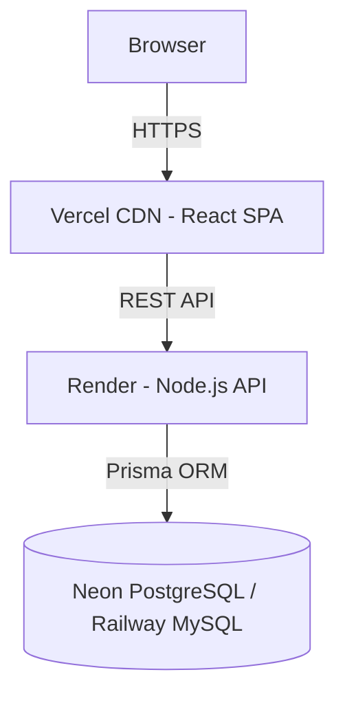

# 🌿 Carbon Equity Tracker

> **A production-grade SaaS platform for tracking, measuring, and reducing carbon emissions — built for individuals, industries, and administrators.**

[](https://github.com/YOUR_USERNAME/Carbon-Equity-Tracker/actions)
[](LICENSE)
[](https://www.typescriptlang.org/)
[](https://prisma.io)

---

## 🚀 Live Demo

| Role | Email | Password |
|------|-------|----------|
| Individual | `user1@tracker.com` | `root` |
| Industry   | `industry100@tracker.com` | `root` |
| Admin      | `admin@tracker.com` | `admin123` |

---

## ✨ Features

- **Cinematic Landing Page** — Animated aurora background, hero section, feature showcase
- **Role-Based Dashboards** — Individual, Industry, and Admin panels
- **Real-Time CO₂ Calculation** — Instant emission estimates as you adjust inputs
- **Interactive Analytics** — Recharts-powered pie charts, trend lines, benchmark bars
- **Sustainability Score** — Radial gauge showing your environmental performance
- **JWT Authentication** — Secure login, signup, and protected routes
- **Dark/Light Mode** — Full theme support across all pages
- **Production DevOps** — Docker, docker-compose, GitHub Actions CI/CD

---

## 🧱 Tech Stack

| Layer | Technology |
|-------|-----------|
| Frontend | React 18 + TypeScript + Vite |
| Styling | Tailwind CSS v3 + Framer Motion |
| Charts | Recharts |
| Backend | Node.js + Express + TypeScript |
| ORM | Prisma (MySQL) |
| Auth | JWT + bcryptjs |
| DevOps | Docker + GitHub Actions |

---

## 🏃 Quick Start (Local Development)

### Prerequisites
- Node.js 20+
- MySQL 8.0 running locally
- Git

### 1. Clone
```bash
git clone https://github.com/YOUR_USERNAME/Carbon-Equity-Tracker.git
cd "Carbon Equity Tracker"
```

### 2. Backend Setup
```bash
cd backend
cp .env.example .env
# Edit .env — set DATABASE_URL and JWT_SECRET
npm install
npx prisma migrate dev --name init
npx prisma db seed
npm run build
node dist/index.js
```

### 3. Frontend Setup
```bash
cd frontend
npm install
npm run dev
```

### 4. Open
Visit **http://localhost:5173**

---

## 🐳 Docker Deployment

```bash
# Build and start all services
docker-compose up --build -d

# Access the app
open http://localhost:3000
```

**Environment variables for Docker** — edit `docker-compose.yml` or create a `.env` at the project root:
```env
MYSQL_ROOT_PASSWORD=your_secure_password
JWT_SECRET=your_64_char_secret
```

---

## 🌐 Cloud Deployment

| Service | Platform | Guide |
|---------|----------|-------|
| Frontend | Vercel | [docs/DEPLOYMENT.md#vercel](docs/DEPLOYMENT.md#vercel) |
| Backend  | Render | [docs/DEPLOYMENT.md#render](docs/DEPLOYMENT.md#render) |
| Database | Neon (PostgreSQL) or Railway (MySQL) | [docs/DEPLOYMENT.md#database](docs/DEPLOYMENT.md#database) |

---

## 📐 Architecture



---

## 🗂️ Project Structure

```
Carbon Equity Tracker/
├── frontend/                # React + TS + Vite SPA
│   ├── src/
│   │   ├── components/      # Reusable UI, layout, chart components
│   │   ├── contexts/        # AuthContext (JWT + theme)
│   │   └── pages/           # Landing, Login, Signup, Dashboards
│   ├── Dockerfile
│   └── tailwind.config.js
├── backend/                 # Node.js + Express + Prisma API
│   ├── src/
│   │   ├── controllers/     # authController, emissionsController
│   │   ├── middleware/       # JWT auth
│   │   └── routes/          # authRoutes, emissionsRoutes
│   ├── prisma/
│   │   └── schema.prisma    # User, UserEmission, IndustryEmission
│   └── Dockerfile
├── docs/                    # Architecture, API, DB, Deployment docs
├── .github/workflows/       # CI/CD pipelines
└── docker-compose.yml
```

---

## 📚 Documentation

| Document | Description |
|----------|-------------|
| [Architecture](docs/ARCHITECTURE.md) | System design, component flow, ER diagram |
| [Database](docs/DATABASE.md) | Schema, indexes, relationships |
| [API Reference](docs/API.md) | All endpoints, request/response schemas |
| [Deployment](docs/DEPLOYMENT.md) | Vercel, Render, Neon, Docker, CI/CD |
| [User Guide](docs/USER_GUIDE.md) | How to use each dashboard |

---

## 🔐 Environment Variables

| Variable | Required | Description |
|----------|----------|-------------|
| `DATABASE_URL` | ✅ | MySQL/PostgreSQL connection string |
| `JWT_SECRET` | ✅ | Min 64-char secret for signing tokens |
| `PORT` | ❌ | API port (default: 5000) |
| `NODE_ENV` | ❌ | `development` or `production` |
| `ALLOWED_ORIGINS` | ❌ | Comma-separated CORS origins |

---

## 📄 License

MIT — see [LICENSE](LICENSE)

---

*Built with 💚 for climate accountability, Showcased in portfolios, hackathons, and interviews.*
