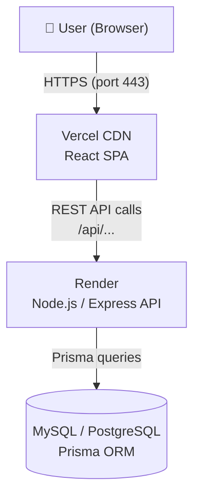
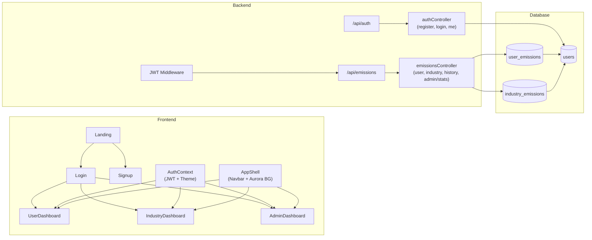
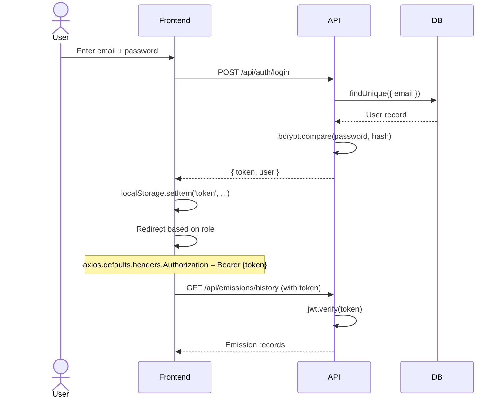
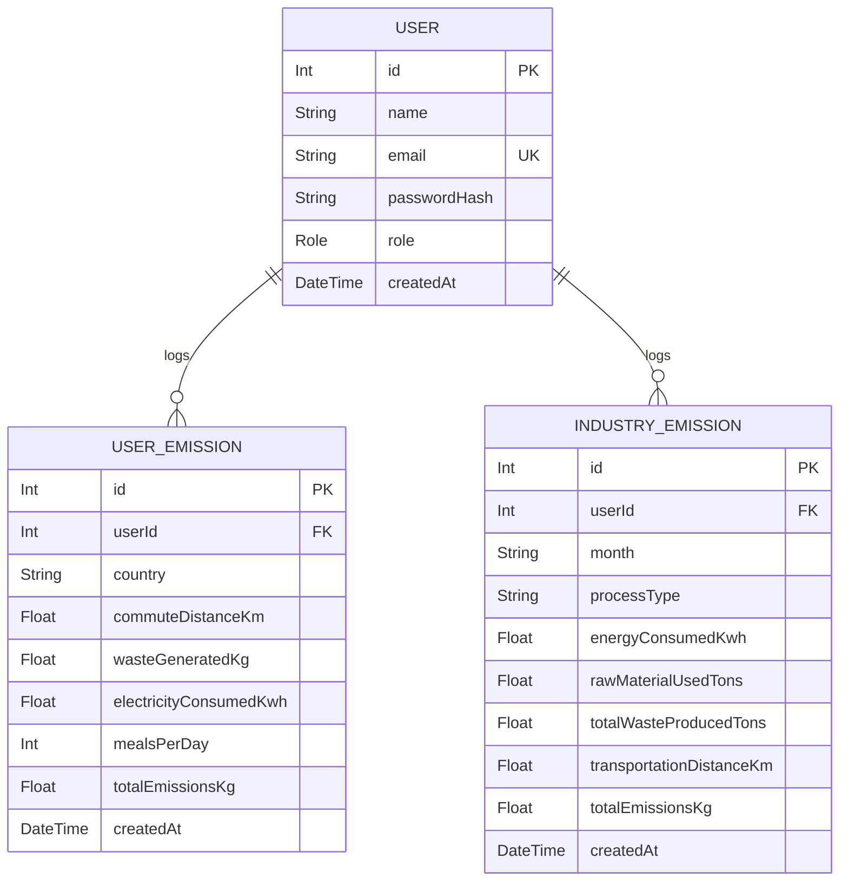

# Architecture Documentation

## System Overview

Carbon Equity Tracker is a three-tier SaaS application:



---

## Component Architecture



---

## Authentication Flow



---

## Database ER Diagram



---

## Frontend Component Tree

```
App
├── Landing (public, /)
├── Login   (public, /login)
├── Signup  (public, /signup)
└── [PrivateRoute]
    ├── UserDashboard    (INDIVIDUAL role, /user-dashboard)
    │   └── AppShell → Navbar + AnimatedBackground
    │       ├── KpiCard × 4
    │       ├── SustainabilityScore (radial gauge)
    │       ├── CustomSlider × 3
    │       ├── CategoryBreakdown (PieChart)
    │       ├── EmissionsTrend (AreaChart)
    │       └── DataTable (paginated history)
    ├── IndustryDashboard (INDUSTRY role, /industry-dashboard)
    │   └── AppShell
    │       ├── KpiCard × 4
    │       ├── Warning Banner (conditional)
    │       ├── CustomSlider × 3
    │       ├── CategoryBreakdown
    │       ├── BenchmarkBar
    │       └── DataTable
    └── AdminDashboard    (ADMIN role, /admin-dashboard)
        └── AppShell
            ├── KpiCard × 6
            ├── BenchmarkBar (avg comparison)
            ├── EmissionsTrend × 2
            └── DataTable × 2
```
